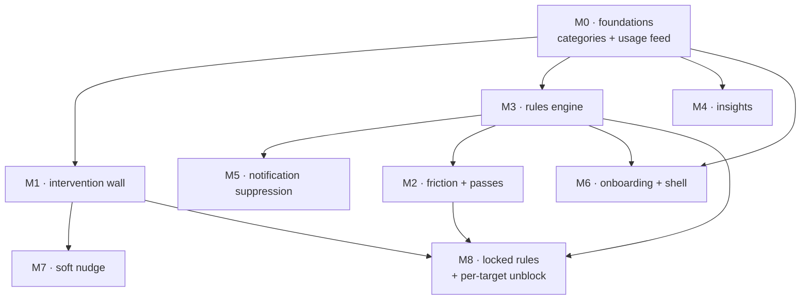

# Detoxo — Feature Plan (milestones M0–M7)

The **forward-looking** documentation set. Where [`code_docs/`](../code_docs/00-index.md) describes
Detoxo **as shipped**, this set describes what Detoxo is going to be able to do next, and exactly
how — milestone by milestone.

It is the landing point for [`../suggestion_docs/flutter-migration/`](../suggestion_docs/flutter-migration/00-architecture-and-strategy.md),
a 27-document port guide derived from a decompile of a **general Android screen-time blocker**
(the *source app*; version 4.10.0). That guide describes a different product. This set decides, per capability,
what Detoxo takes from it, what it adapts, and what it refuses — then specifies the take in
Detoxo's own architecture.

> **Status discipline.** A milestone doc is a *plan*. `code_docs/` stays "written from shipped
> source" and never describes unbuilt work. A milestone graduates when its engineering doc is
> written into `code_docs/NN-*.md` and its plan doc is stamped `Status: shipped` with the commit.

| Doc | Milestone | What it adds |
|---|---|---|
| 00 | this file | Index · invariants · adoption matrix · sequencing |
| [01](01-M0-foundations.md) | **M0** | App/website **category catalog** + the **usage-stats signal layer** — **shipped**, see [`code_docs/26`](../code_docs/26-catalog-and-usage-signal.md) |
| [02](02-M1-intervention-wall.md) | **M1** | The **block-screen overlay** — a real wall instead of a silent back-press — **shipped**, see [`code_docs/25`](../code_docs/25-block-screen.md) |
| [03](03-M2-friction-and-passes.md) | **M2** | **Waiting room** friction + **emergency pass** (1 h / 7 d) |
| [04](04-M3-rules-engine.md) | **M3** | **Rules engine** — schedules, daily time limits, open limits — **shipped (lean core)**, see [`code_docs/27`](../code_docs/27-rules-engine.md) |
| [05](05-M4-insights.md) | **M4** | **Real screen time** — pickups, distraction time, context switches · shipped, see [`code_docs/28`](../code_docs/28-insights.md) |
| [06](06-M5-notification-suppression.md) | **M5** | **Notification suppression** for blocked apps — **shipped**, see [`code_docs/29`](../code_docs/29-notification-suppression.md) |
| [07](07-M6-onboarding-and-shell.md) | **M6** | Resumable **onboarding step machine** + **shell/nav** rework — **shipped**, see [`code_docs/13`](../code_docs/13-onboarding-permissions.md) + [`code_docs/01`](../code_docs/01-overview-architecture.md) §3–§4 |
| [08](08-M7-soft-nudge.md) | **M7** | **Soft nudge** — the gentle counterpart to the wall — **shipped**, see [`code_docs/30`](../code_docs/30-soft-nudge.md) |
| [10](10-M8-locked-rules-and-app-unblock.md) | **M8** | **Locked rules** + **per-target unblock** (unblock one app, not everything) |
| [09](09-contracts-and-storage.md) | — | The consolidated **channel + storage delta** for all nine — the contract of record, reconciled against shipped code |

---

## Invariants — these override every idea in the suggestion docs

Restate these inline in any prompt or task derived from this set. They are not negotiable, and
several of them are directly contradicted by the source material.

- **Names.** **Detoxo** and **errorxperts** are the only app and vendor names anywhere — code,
  assets, config, docs, filenames. The suggestion docs are full of the source app's and its
  vendor's names; **none of it survives the port — not even as a quotation.** Never a
  `:as_process` suffix.
- **One channel pair.** One MethodChannel `com.errorxperts.detoxo/commands` and one EventChannel
  `com.errorxperts.detoxo/events`. The suggestion docs invent **seven** channel namespaces — for
  device signal (control + events), usage stats, the block screen, the enforcement service,
  permissions, notification suppression, and the activity/light sensors. **Every one of them
  becomes new method names and new event `type` values on the existing pair.** See
  [09](09-contracts-and-storage.md).
- **Single process.** The AccessibilityService already *is* the foreground service
  (`startForeground(1125, …, FOREGROUND_SERVICE_TYPE_SPECIAL_USE)` at
  [`DetoxoAccessibilityService.kt:1117`](../../android/app/src/main/kotlin/com/errorxperts/detoxo/accessibility/DetoxoAccessibilityService.kt#L1117)).
  No second process, and **no second FlutterEngine** — B1's headless-engine-in-a-service design
  is rejected outright.
- **Wire token.** `curious` / `"CURIOUS"` stays verbatim in code and channel payloads; its
  user-facing label is **"Conscious"**. Leaking either direction is a defect.
- **Offline-first.** No `lib/core/network/`, no HTTP client, no backend — by design, not by
  omission. Everything in the suggestion set that needs a server is excluded; see the matrix.
- **Storage.** Hive box `detoxo` via [`lib/core/storage/local_store.dart`](../../lib/core/storage/local_store.dart)
  + `FlutterSecureStorage` + native `SharedPreferences` `detoxo_engine_prefs`. **No drift, no
  SQLite, no new database.** The suggestion set's [A2](../suggestion_docs/flutter-migration/A-foundations/A2-local-database.md)
  is a 20-table drift schema; every table it defines that this plan actually needs is re-modelled
  as a Hive JSON record under a new `StoreKeys` constant.
- **Stack.** flutter_bloc **Cubit** + get_it (`sl`) + go_router. No Riverpod, no event-BLoCs — the
  suggestion docs assume Riverpod `StateNotifier` throughout; translate, don't import.
- **Boundaries.** A feature is reached only through its barrel `lib/features/<x>/<x>.dart` or
  another feature's `domain/`, enforced by `tool/check_boundaries.sh`.
  **`tool/boundaries_baseline.txt` only shrinks** — no milestone may add a line to it.
- **Premium** is a local dev-unlock (`StoreKeys.premiumDevUnlock`). **iOS** is an unsupported
  screen. No paid SaaS enters the app: not RevenueCat, Superwall, Adjust or Amplitude.

### Branding — the source docs are written for a different app

The suggestion set is a port guide for another product, and **the source app's name is baked into
its channel names, log tags, package paths, button labels and screen names**. Every one is
rewritten to Detoxo before a line is ported — this is the naming invariant, not a style
preference. The table below names the *kind* of each identifier rather than reproducing it,
because the invariant applies to these documents too.

| Kind of identifier in the suggestion docs | In Detoxo |
|---|---|
| all seven vendor-prefixed channel namespaces | `com.errorxperts.detoxo/commands` · `/events` |
| vendor package paths | `com.errorxperts.detoxo` |
| **"Open \<source app\>"** (B7's wall button) | **"Open Detoxo"** |
| a hardcoded vendor string as the log tag | `Log.w(TAG, …)` — the existing per-class `TAG` |
| vendor-prefixed `…Database`, `…FirebaseMessagingService`, `BlockScreenOverlayManager` | no drift, no FCM; `BlockScreenOverlay` in Detoxo's `overlay/` naming |
| vendor-prefixed notification-channel ids (service, schedules, timers, unblocks) | `detoxo_protection_channel`, `detoxo_watchdog_channel` (existing) |
| vendor-prefixed prefs files (waiting-room batch, notif suppression, context events) | `detoxo_engine_prefs` (existing) |
| vendor deep-link scheme and applink host | not adopted — no referrals, no school |
| **"Sick Day Pass"** (C2's school-flavoured name) | **"Override"** — see [M8](10-M8-locked-rules-and-app-unblock.md) |
| `HubTab.MyApps` | `Routes.home` |
| the source app's obfuscated class names (`fr.i`, `bn.a`, `rn.f`, `yq.b`, `xj.d`, `er.l`) | never reproduced — behaviour and constants only |

The source app's or its vendor's name appearing **anywhere** in this repository — `lib/`,
`android/`, any user-visible string, or these plan docs — is a **defect**. There is no mapping-row
carve-out: refer to it as "the source app" and describe the identifier's kind, as above.

## Budget guardrails

Every milestone respects these. They are budgets, never knobs to retune as a side effect of
something else:

| Constant | Value | Where |
|---|---|---|
| `THROTTLE_MS` | 150 ms | per-package accessibility event throttle |
| `COUNT_THROTTLE_MS` | 400 ms | counting-pass throttle (+ `DFS_SKIP 4` back-off) |
| `BLOCK_DEBOUNCE_MS` | 1200 ms | per-target block debounce |
| `BACK_RATE_LIMIT_MS` | 1100 ms | back-press rate limit |
| `MAX_NODES` | 12000 | stage-3 DFS traversal cap |

**The engine has exactly one ticker.** The 1 Hz `consciousTick` Handler runs *only* while the plan
is Conscious; `WatchdogJobService` (`JOB_ID 1126`, 15-minute persisted periodic) is the only job.
Anything in this plan that needs a clock either mirrors the Conscious accountant's
start/stop + runtime-anchor + batched-flush pattern, or rides the watchdog. **No milestone
introduces a new always-on ticker.**

---

## Adoption matrix — all 27 suggestion docs

`adopt` = take it · `adapt` = take the idea, rebuild it for Detoxo · `pattern only` = no feature,
but the shape is worth copying · `skip` = not happening, with the reason.

| Source doc | Verdict | Milestone / reason |
|---|---|---|
| **A1** Device Signal Layer | adapt (partial) | **M0.2** — the UsageStats feed only. A1's browser/URL half is dropped: [`engine/BrowserUrlExtractor.kt`](../../android/app/src/main/kotlin/com/errorxperts/detoxo/engine/BrowserUrlExtractor.kt) already does it better (~22 packages of per-browser url-bar ids → bounded DFS → focused-node skip). |
| **A2** Local Database | pattern only | Storage decision: Hive, not drift. Entity *shapes* and enum vocabularies are reused; the schema is not. |
| **A3** Category Catalog | **adopt** | **M0.1** |
| **A4** App Picker | skip | Already shipped — `installedApps` + label/icon cache + the picker, hardened by EVO-006/007/008/010. |
| **A5** Permissions | pattern only | Detoxo's funnel is already richer (tri-state reads, `lastKnownGranted` fallback, ECM/restricted-settings recovery). Only the **notification-listener grant** was new; it shipped in M5 as the seventh entry. |
| **B1** App Blocker | adapt | The verdict path is already native and already the FGS. Take the `BlockScreenPayload` shape; reject the headless FlutterEngine, the enforcement-service channel, and the second FGS. |
| **B2** Rules Engine | **adopt** | **M3** |
| **B3** Timer / Digital Detox | skip | Pause (2–10 min), Conscious, One Reel and Unblock already cover transient self-imposed sessions. A fifth is not differentiator-first. |
| **B4** Waiting Room | **adopt** | **M2.1**; its `temporary_unblocks` grant model is generalised to every target type in **M8** |
| **B5** Autofocus | adapt | **M7** — shipped: the dwell state machine only. Sensors, GMS activity recognition and `ACTIVITY_RECOGNITION` are dropped (see 08 §Deviation). |
| **B6** Notification Suppression | **adopt** | **M5** — shipped, with the pre-computed set replaced by native live evaluation (see 06 §Deviation) |
| **B7** Overlay Block Screen | **adopt** | **M1**, including both payload affordances — `offersOpenApp` ("Open Detoxo") and `offersUnblock`, whose flow lands in **M8**. Only the `FakeLifecycleOwner` is dropped, because Detoxo renders on a Canvas rather than hosting a `ComposeView`. |
| **C1** Groups / Family | skip | Needs a backend. |
| **C2** Managed Rules & Self-Bypass | **adapt** | **M8** — the *authority* needs a backend; the **mechanics do not**. Re-pointed at the authority Detoxo already has: past-you. Non-disableable rules enforced in the domain layer, quota-limited overrides with a reason and a window, `effectiveRemaining` computed locally (C2's offline fallback becomes the primary path), and `blockScope: DistractingApps` resolved through M0.1's catalog. Its "Sick Day Pass" becomes **"Override"**. |
| **C3** School Mode | skip | Needs a backend. |
| **D1** Stats & Insights | **adopt** | **M4** — minus the four backend-only fields (sleep, sleepConsistency, firstHourAwake, weather) and minus the SaaS Pro gate. |
| **D2** Onboarding | **adopt** | **M6** — minus the school-invite branch. |
| **D3** Hub Shell & Navigation | adapt | **M6** — the architecture (`StatefulShellRoute.indexedStack`, ordered `AppInitializer`, keyed sheet-result bus). Its 51-route inventory and its auth/school/referral/Superwall/App-Check/FCM bootstrap phases are discarded. |
| **D4** Emergency Pass | **adopt** | **M2.2** |
| **D5** Gemstones & Referrals | skip | The referral half needs a backend; the reward ladder is not differentiator-first. |
| **E1** Notifications & Scheduling | pattern only | `flutter_local_notifications` is already declared and unwired. The **supersede table** and the `<category>:<entity>:` prefix-cancel convention are the ideas worth keeping; they fold into M3's boundary notifications. |
| **E2** Push / FCM | skip | No backend, nothing to send. |
| **E3** Heartbeat & Daily-Active | skip | The heartbeat exists to feed a remote supervisor dashboard. The **canonical-timezone day-boundary dedupe** idea folds into M4. |
| **E4** v3 Legacy Migration | skip | Detoxo has no legacy users to migrate. Retained in this matrix as the **reference template** for any future storage migration: per-record catch that never aborts the step, whole-blob read failure isolated per step, flag + in-process lock for idempotency, and "leave state PENDING on a whole-run crash so the next launch retries once". |
| **E5** Analytics & Attribution | pattern only | Attribution is three paid SaaS (Adjust, Amplitude, RevenueCat) — excluded. The **4-method `AnalyticsTracker` interface + sealed event catalog + NoOp-as-default-binding** is a contract upgrade for the existing local `AnalyticsRepository`; recorded here, not scheduled as a milestone. |
| **E6** Monetization & Paywalls | pattern only | RevenueCat + Superwall are excluded. Two ideas are kept on record: the **fail-open gate** (on *any* failure path the feature callback still fires — never lock a legitimate user out because the gate broke) and a single `proGate(placement, feature)` call site, which is the right seam for `StoreKeys.premiumDevUnlock` if real billing ever lands. |
| **E7** Auth & Account | skip | No accounts. The one locally-useful piece — biometric app lock — already ships in `lib/features/access_protection/` via `local_auth`. |

### What the suggestion set gets wrong (recorded so it is not re-derived)

The source docs are internally inconsistent in ways that will waste time if hit cold:

1. **Doc-ID cross-references are unreliable.** B1 cites "A5 — installed/launchable app catalog"
   (that is A4); B2 cites "A4-foreground-detection" (that is A1); B1 cites "A2 — website/URL
   detection" (that is A1); B6 cites "A5-notification-listener-permission" but A5 covers only
   three grants and not the listener. **Match on capability, never on the ID string.**
2. **Three incompatible verdict models.** B1/B6 use a precomputed map +
   `BlockVerdict{Allowed, Strict, Unblockable, Unblocked}`; B2 uses a rule-list scan returning
   `Allow | Block(rule, reason)`; B6 elsewhere uses a third 3-case shape. **M3's is canonical for
   Detoxo:** rules are scanned in Dart and the result is a flat pushed snapshot.
3. **B2 corrects B-family assumptions**: `lockPeriod` / `lockDurationMillis` live on *time-limit*
   details, **not** session details; session details carry **no** unblock-selection columns.
4. **B3 writes enum values that do not exist** (`activationType: Manual`,
   `blockingSelectionType: AllowList/BlockList`). The real vocabularies are
   `{DateInterval, Repeating, AlwaysOn}` and `{Block, AllExcept}`.
5. **A2 says "18 `Local*` enums" and then lists 17.** Count nothing from prose.
6. **Values that are knobs, not recovered constants** — each needs a product decision, not an
   archaeology session: A1's UsageStats poll interval; B4's base wait, grant duration and
   escalation curve; B5's sensor-classifier thresholds; A1's domain-validation regex.

---

## Sequencing

**M0 first** because the category catalog and real usage data are what M3, M4 and M7 all read, and
because activating `PACKAGE_USAGE_STATS` — declared in the manifest, granted through the funnel,
and read by exactly nothing today — is the single highest-leverage thing available.
**M1 before M7** because the nudge renders through the wall's window and adds no window code of
its own. **M3 before M5** because the suppressed package set is the rules engine's output and the
`ruleBoundary` event is what keeps that set from going stale. **M6 last** because a resumable
onboarding that ends by creating a starter rule needs both the catalog (M0.1) and rules (M3) to
exist.

**M8 last** because it needs all three of its inputs: M1's wall raises the Unblock button, M2 owns
the friction gate and the bypass ledger it spends from, and M3 owns the rules it locks. It is also
the milestone that makes the rest safe to ship — M1, M3 and M5 all *tighten* the app, and M8 is the
release valve that keeps a tightened app from being uninstalled instead of used.

Milestones are independently shippable. M1 alone is a visible product improvement; M0 + M4 alone
is an honest-numbers release. The one pairing that should **not** be split is locking rules without
shipping the override that lifts them.

---

## Related

- Shipped behaviour: [`../code_docs/00-index.md`](../code_docs/00-index.md)
- End-user framing: [`../info_docs/01-product-overview.md`](../info_docs/01-product-overview.md)
- Corrective backlog (EVO-scale): [`../evolution/BACKLOG.md`](../evolution/BACKLOG.md)
- Source material: [`../suggestion_docs/flutter-migration/00-architecture-and-strategy.md`](../suggestion_docs/flutter-migration/00-architecture-and-strategy.md)

### Known non-goal, recorded here so it is not re-litigated

`drift ^2.33.0`, `drift_dev ^2.33.0` and `sqlite3_flutter_libs ^0.6.0+eol` are declared in
`pubspec.yaml` and imported by **nothing** (`grep -rn 'package:drift' lib/ test/` → zero hits),
costing roughly 1.63 MB per user. The storage decision for this plan keeps them unused. Removing
them is a clean EVO-scale cleanup and is deliberately **not** folded into any milestone here.
